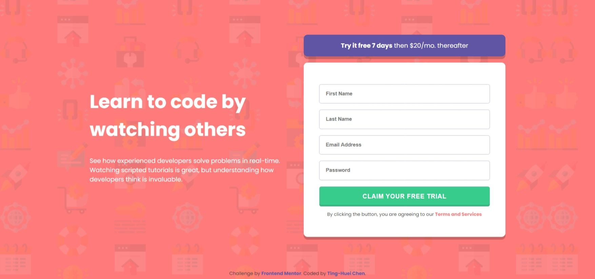

# Frontend Mentor - Intro component with sign up form

This is a solution to the [Intro component with sign up form challenge on Frontend Mentor](https://www.frontendmentor.io/challenges/intro-component-with-signup-form-5cf91bd49edda32581d28fd1). Frontend Mentor challenges help you improve your coding skills by building realistic projects.

## Table of contents

- [Overview](#overview)
  - [The challenge](#the-challenge)
  - [Screenshot](#screenshot)
  - [Links](#links)
- [My process](#my-process)
  - [Built with](#built-with)
  - [What I learned](#what-i-learned)
  - [Continued development](#continued-development)
  - [Useful resources](#useful-resources)
- [Author](#author)
- [Acknowledgments](#acknowledgments)

**Note: Delete this note and update the table of contents based on what sections you keep.**

## Overview

### The challenge

Users should be able to:

- View the optimal layout for the site depending on their device's screen size
- See hover states for all interactive elements on the page
- Receive an error message when the `form` is submitted if:
  - Any `input` field is empty. The message for this error should say _"[Field Name] cannot be empty"_
  - The email address is not formatted correctly (i.e. a correct email address should have this structure: `name@host.tld`). The message for this error should say _"Looks like this is not an email"_

### Screenshot



### Links

- Solution URL: [Github repository](https://github.com/hejkeikei/pricing-component-with-toggle)
- Live Site URL: [hejkeikei.github.io](https://hejkeikei.github.io/pricing-component-with-toggle-master)

## My process

- Write with semantic markup.
- Get JavaScript working
- Plan the layout.
- Go through validators.
- Set all root figures and font.
- Write CSS for general tags.
- Write classes' and ids' style.
- Responsive design
- Get all CSS done, check on both desktop and mobile.

### Built with

- Semantic HTML5 markup
- CSS custom properties
- Flexbox
- JavaScript

### What I learned

- Validating email using Regular Expression

```js
if (/[a-z0-9._%+-]+@[a-z0-9.-]+\.[a-z]{2,4}$/.test(email.value)) {
  // Hide error message
} else if (email.value != "") {
  // Show error message
}
```

- Show error message
  My method was to append messages right after every input field:

```js
var msg = document.createElement("p");
msg.innerHTML = i.getAttribute("placeholder") + " cannot be empty";
msg.classList.add("errMsg");
i.parentNode.insertBefore(msg, i.nextSibling);
```

However, I find the method above will cause extra elements after the second attempt that user submit the form.
The final method is to have the element ready in HTML:

```html
<input type="text" />
<p class="errMsg"></p>
```

Then select the elements right after input field to fill the content in the pre-existing elements:

```js
inputfield.nextElementSibling.innerHTML =
  fields[i].getAttribute("placeholder") + " cannot be empty";
```

### Continued development

- Make the page after submitting the form.
- try to replace some js with CSS `::invalid` pseudo element.

### Useful resources

- [Email validation](https://www.w3resource.com/javascript/form/email-validation.php) - This helped me style my toggle prettier.
- [Icon in input field](https://stackoverflow.com/questions/917610/put-icon-inside-input-element-in-a-form) - I wasn't sure about which way should I do with icons, this is the approach I liked the most!
- [Regular Expression](https://regex101.com/) - This is a great website that could fiddle with regex and preview the result.

## Author

- Codepen - [TingHueiChen](https://codepen.io/TingHueiChen)
- Frontend Mentor - [@hejkeikei](https://www.frontendmentor.io/profile/hejkeikei)
- Twitter - [@hej_keikei](https://twitter.com/hej_keikei)

## Acknowledgments

The Regular Expression of email validation came from [w3resource] (https://www.w3resource.com/)
